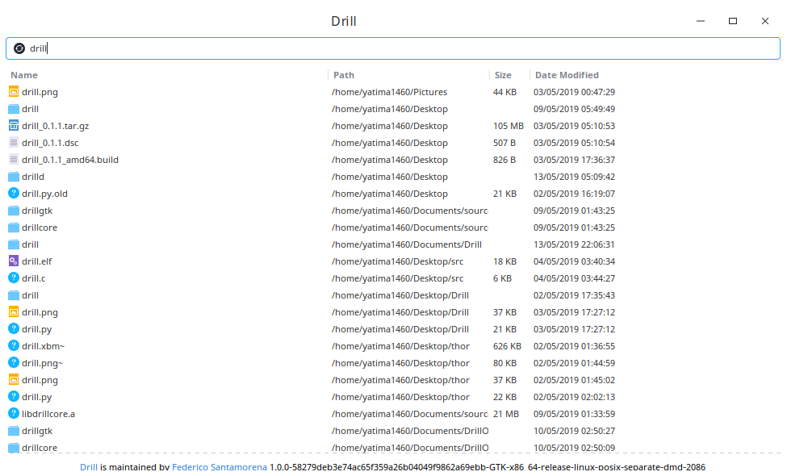

# Drill v0.1.0a


## TL;DR: What is this

Search files without using indexing, but clever crawling:
- 1 thread per disk
- Use as much RAM as possible for caching stuff
- Try to avoid "black hole folders" in which the crawler will never come out and never scan useful files (`node_modules`)
- intended for desktop users, /home and /media scans, no obscure Linux files




## Fast guide

### Requirements
```
Linux
Python 3
sudo apt install python3-tk

optional:
also if you install psutil you will see the memory usage in real time
pip3 install psutil
```

### Run
```
python3 drill.py

or

chmod +x drill.py
./drill.py
```

## Guide
```
Double click    = open
Right click     = open containing folder
Return/Enter    = open
```

## What is this

I was stressed on Linux because I couldn't find the files I needed, file searchers based on system indexing (updatedb) are prone to breaking and hard to configure for the average user, so did an all nighter and started this.

Drill is a modern file searcher for Linux that tries to fix the old problem of slow searching and indexing.
Nowadays even some SSDs are used for storage and every PC has nearly a minimum of 8GB of RAM and quad-core;
knowing this it's time to design a future-proof file searcher that doesn't care about weak systems and uses the full multithreaded power in a clever way to find your files in the fastest possible way.

* Heuristics:
The first change was the algorithm, a lot of file searchers use depth-first algorithms, this is a very stupid choice and everyone that implemented it is a moron, why? 
You see, normal humans don't create nested folders too much and you will probably get lost inside "black hole folders" or artificial archives (created by software); a breadth-first algorithm that scans your hard disks by depth has a higher chance to find the files you need.
Second change is excluding some obvious folders while crawling like `Windows` and `node_modules`, the average user doesn't care about .dlls and all the system files, and generally even devs too don't care, and if you need to find a system file you already know what you are doing and you should not use a UI tool.

* Clever multithreading: The second change is clever multithreading, I've never seen a file searcher that starts a thread *per disk* and it's 2019. The limitation for file searchers is 99% of the time just the disk speed, not the CPU or RAM, then why everyone just scans the disks sequentially????

* Use your goddamn RAM: The third change is caching everything, I don't care about your RAM, I will use even 8GB of your RAM if this provides me a faster way to find your files, unused RAM is wasted RAM, even truer the more time passes.

## TODO

There is a lot of stuff to do and to fix, all written in the `drill.py` file